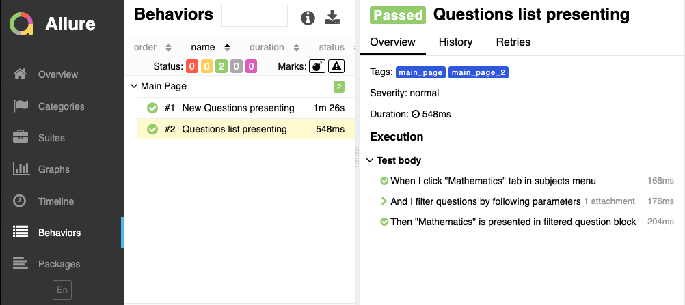

# python-bdd-framework-template:
This is a POC of BDD framework in Python. Following stack is using:
- behave
- allure
- selenium
- pyhamcrest

# Setup
1. git clone https://github.com/asket888/brainly_interview_task.git
2. cp config.json.example config.json
3. Add actual passwords for all tested environments

# Command line Execution:
1. navigate to project directory
2. run `pipenv install --dev --system` to setup all necessary dependencies from Pipfile.lock
3. run `pipenv shell` to be able use all pipenv dependencies from terminal
4. to run tests without report creating use command `invoke run`
5. to run tests with allure-report creating use command `invoke run-with-allure`

# Tests parametrization
use `--env`, `--browser`, `--tags` parameters with your cmd to run tests with specific settings 
(e.g `invoke run --browser=CH_HL --env=UAT --tags=@main_page_1`)

# Failed tests rerun
If during test run some tests are failed, information about this writes to 'rerun_failing.features' file. 
To rerun only failed tests use command `invoke run-failed`

# Static analysis and autoformat
1. use `prospector` command to run code static analysis
